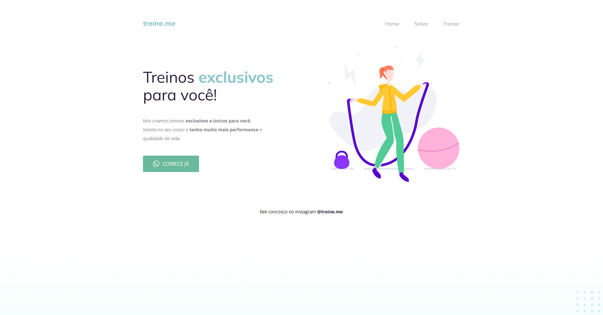

# Projeto de uma página de academia.
### Segundo projeto do módulo Explorer da plataforma RocketSeat.

Nesta aplicação, utilizando HTML e CSS, desenvolvi uma página para uma academia chamada "Treine.me". Neste projeto, foram aplicados alguns conceitos aprendidos nas aulas, tais como:

- Modelo de caixa no CSS;
- Tags semânticas;
- Conceitos de espaçamento e alinhamento mais avançados (comparados ao primeiro projeto);
- Implementação de botões.

# Representação do projeto:

